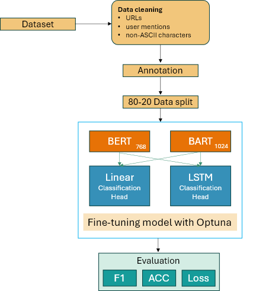
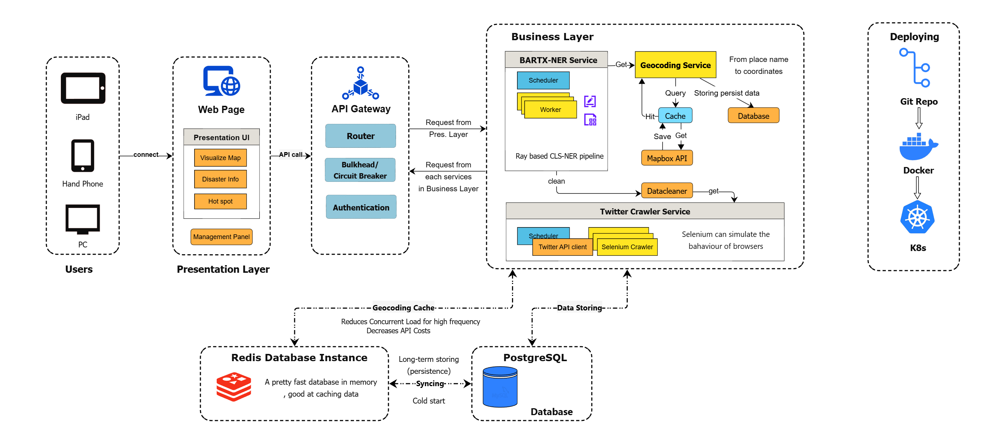

# BART-Disaster-X

## Introduction

BART-Disaster-X is a **multi-label disaster tweet classification system** built with PyTorch Lightning. It can tag a tweet with multiple disaster-related labels simultaneously (e.g. identifying if a tweet involves earthquakes, floods, wildfires, etc.). The project leverages pretrained Transformer models (BERT or BART) as backbones and attaches custom classification heads for fine-tuning on a disaster tweets dataset. By using PyTorch Lightning’s high-level framework, the code cleanly separates data loading, model definition, and training logic for easier experimentation and reproducibility.

## Model Architecture


## Features

* **Transformer Backbones (BERT or BART)**
* **Custom Classification Heads:** Linear or LSTM-based
* **Multi-Label Outputs:** Most 12 categories, Sigmoid activations, optional softmax over mutually exclusive labels
* **Layer-Wise Freezing & Fine-Tuning**
* **Hugging Face Dataset Integration:** `sdy623/new_disaster_tweets` (Coming soon)
* **PyTorch Lightning Modules**
* **Optuna Hyperparameter Tuning**
* **Comet ML Logging**
* **Gradio Web Demo**
* **Configurable & Extensible Architecture**


## Microservice Architecture

The repo is also proposed a scalable microservice-based inference pipeline, allowing robust integration into production environments. Each module (data acquisition, preprocessing, geocoding, classification, and frontend interaction) is containerized and independently deployable.




Key components:

* **Presentation Layer**: A web interface for end-users with disaster map, info display, and hotspot visualization.

* **API Gateway**: Routes and authenticates requests while applying rate-limiting and circuit-breaking strategies.

* **Business Layer**: Comprises modular services like:

* **TDL-CLS-NER Service**: A Ray-based classification-> NER inferance pipeline with scheduler and worker pool.

* **Geocoding Service**: Converts place names to coordinates using Mapbox API, cached via Redis.

* **Twitter Crawler**: Uses Twitter API or Selenium to fetch and simulate user interactions.

* **Datacleaner**: Cleans and normalizes tweet text.

* **Redis & PostgreSQL**: Redis handles short-term caching (e.g., geocoding results) while PostgreSQL provides long-term disaster event storage.

* **Deployment**: All services are dockerized and orchestrated via Kubernetes for robust deployment and scaling.

## Setup

```bash
git clone https://github.com/sdy623/BART-Disaster-X.git
cd BART-Disaster-X
```

```bash
pip install -r requirements.txt
```
Edit `config.py` to adjust pretrained model name, dropout, learning rate, etc.


## Training with Auto Hyperparameter Tuning

```bash
python trainer.py --pruning
```

Models saved in `checkpoints/`, logs in `logs/`, optional Comet dashboard logging.

Tunable params: `lr_bert`, `dropout`, etc. (via Optuna). Monitors `val_f1`. Uses `PatientPruner`.

## Evaluation

```python
trainer.test(model=lit_module, datamodule=lit_datamodule)
```

Or manually load checkpoint and run predictions. Metrics: micro/macro F1, accuracy, precision, recall.

## Inference

```python
model = CustomModel.load_from_checkpoint("checkpoints/model.ckpt")
tokens = tokenizer("Text here", return_tensors="pt")
logits = model(tokens["input_ids"], attention_mask=tokens["attention_mask"])
probs = torch.sigmoid(logits)
```

## Gradio Demo

```bash
python gradio-srv.py
```

Opens a browser for interactive prediction on typed text.

## Results

* Micro F1: \~0.85–0.88 (ModernBERT-Large + LSTM)
* Balanced precision/recall, low false positive rate
* Example: Tweet about wildfire returns tags with `Wildfire`, `Disaster`, `Informative` 

## Acknowledgements

* HuggingFace Transformers & Datasets
* PyTorch Lightning
* Optuna
* Comet ML
* Gradio

Thanks to the open-source community for tools and contributions.

## Dataset Availability

The dataset used in this project (sdy623/new_disaster_tweets) is currently not yet open-sourced. It will be made publicly available on Hugging Face after the paper is published. Thank you for your patience — coming soon!